# 🔄 Business Process Flows - Humber Operations

## 1. 👥 Complete Recruiting Process Flow

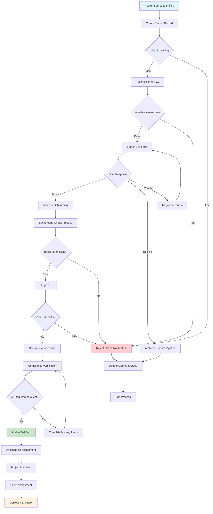

## 2. ⏰ Time Tracking Security Flow

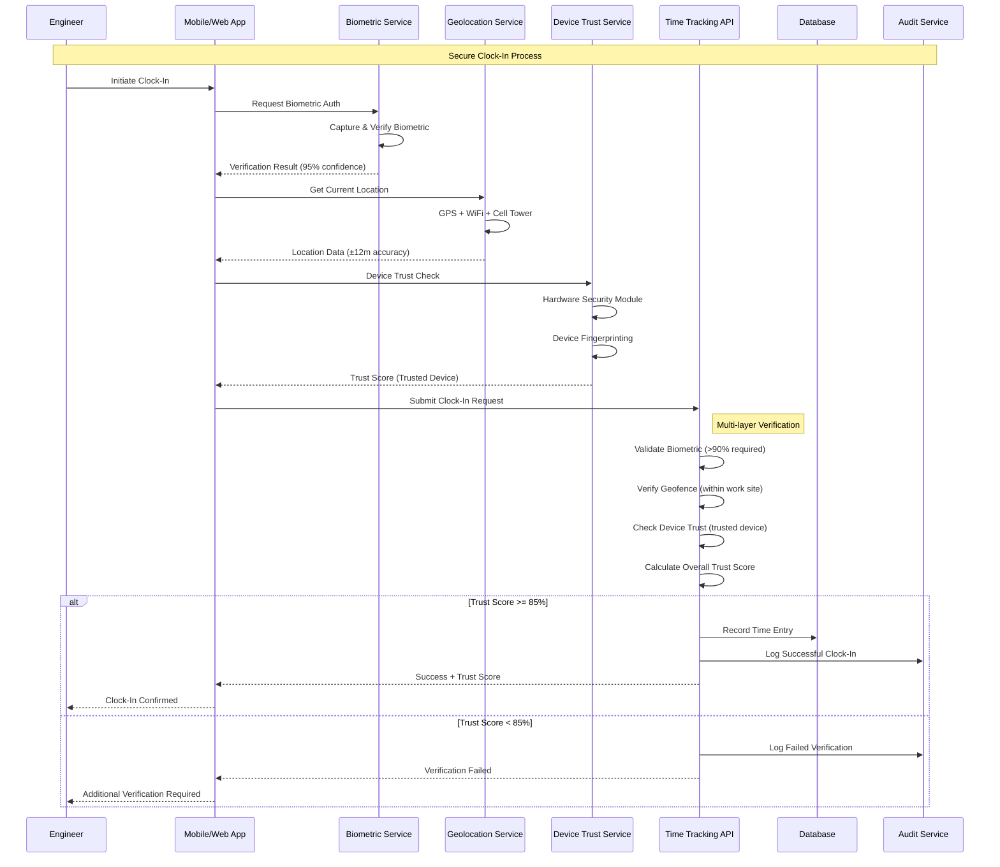

## 3. 📊 Timesheet Reconciliation Flow

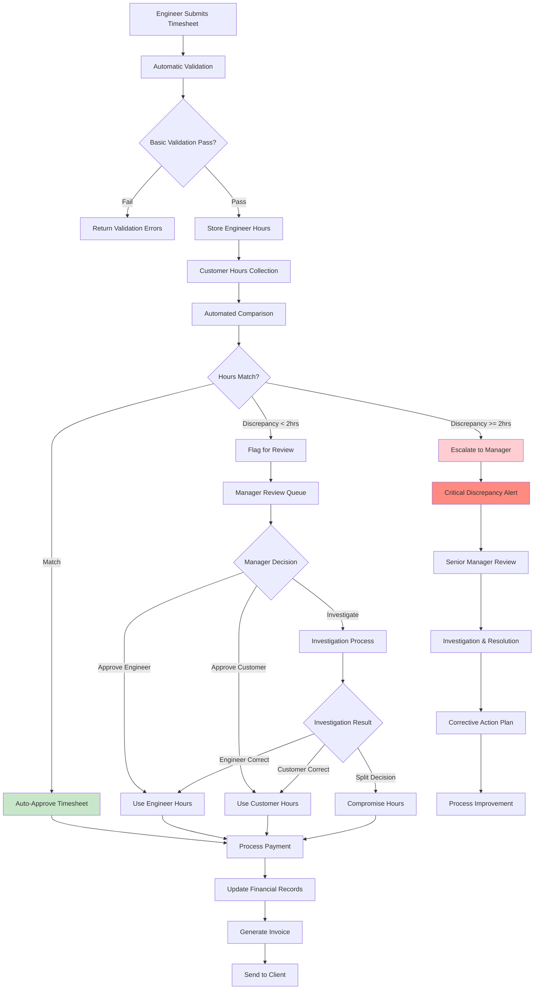

## 4. 🎯 Bull Pen Assignment Process

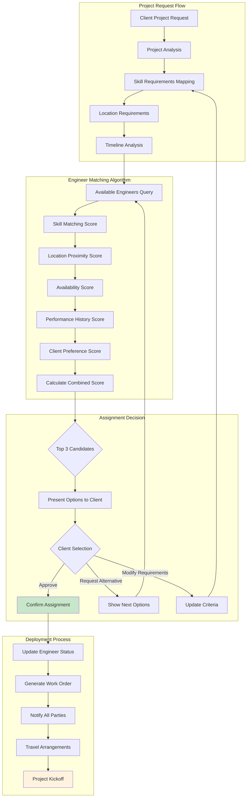

## 5. 🔐 Security Incident Response Flow

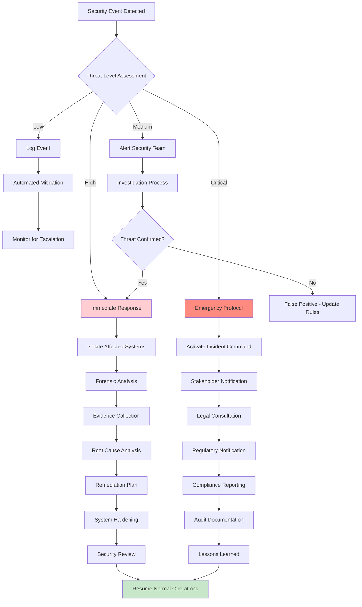

## 6. 📄 Document Management & RAG Flow

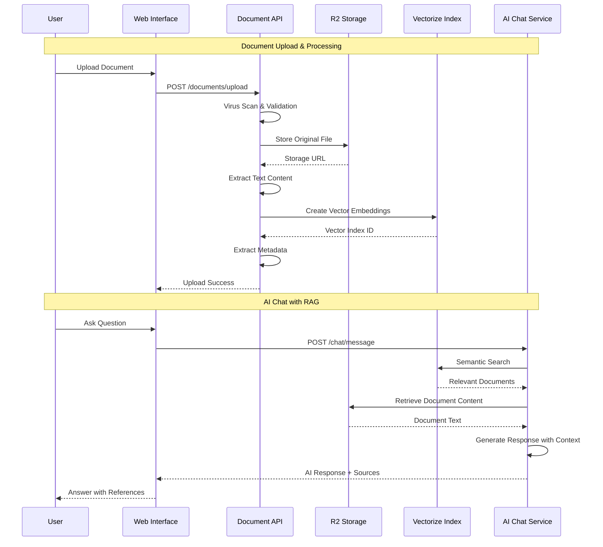

## 7. 💰 Financial Reconciliation Flow

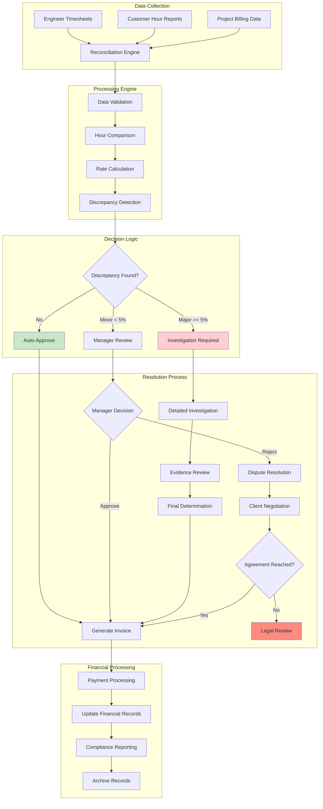

## 8. 🏭 Client Integration Architecture

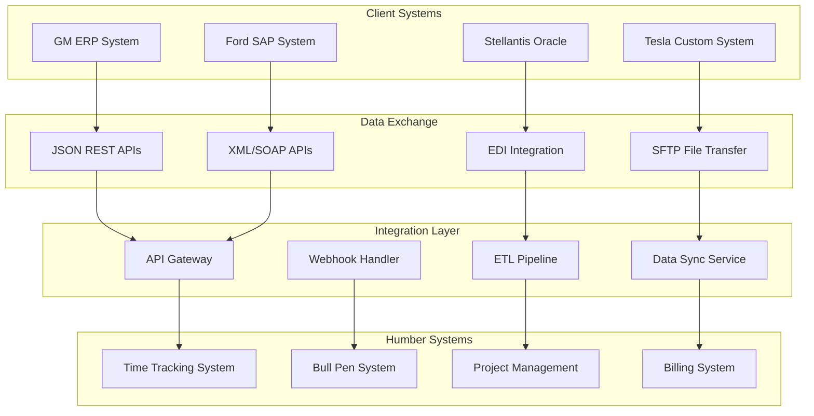

## 9. 📧 Notification System Flow

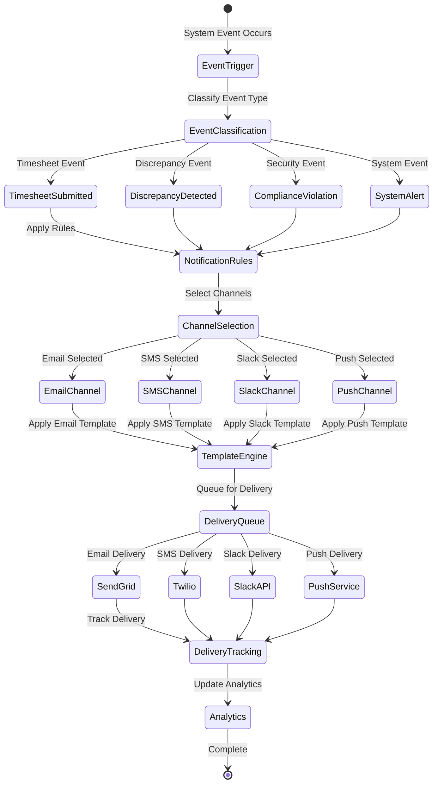

## 10. 🏛️ Compliance Audit Flow

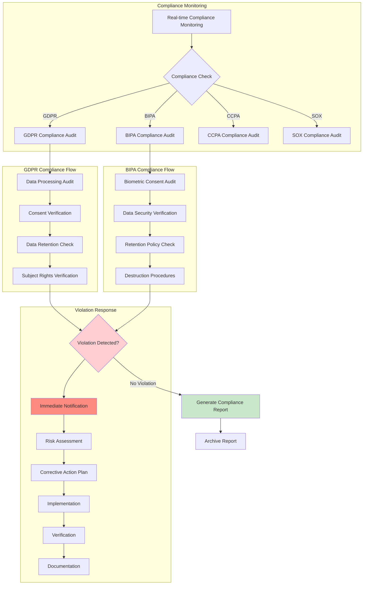

## 11. 🔄 Data Lifecycle Management

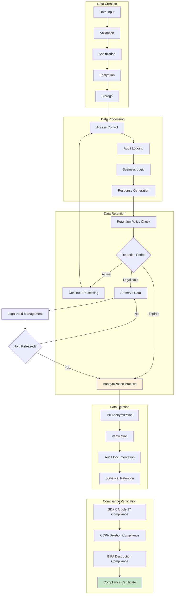

## 12. 🚀 Deployment & Scaling Architecture

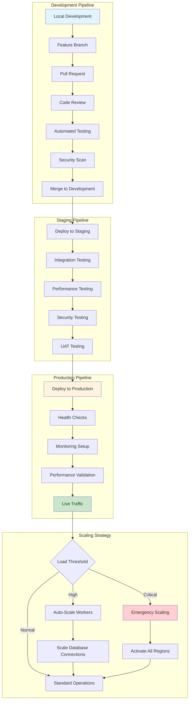

## 13. 💼 Enterprise Integration Patterns

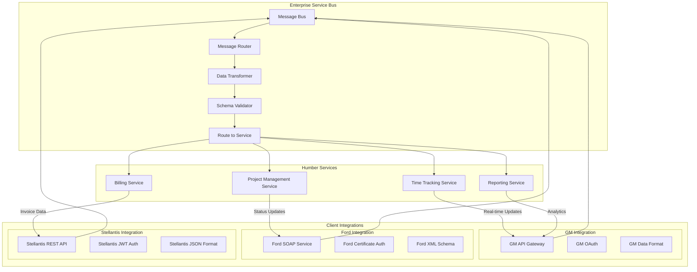

## 14. 🔍 Monitoring & Observability Architecture

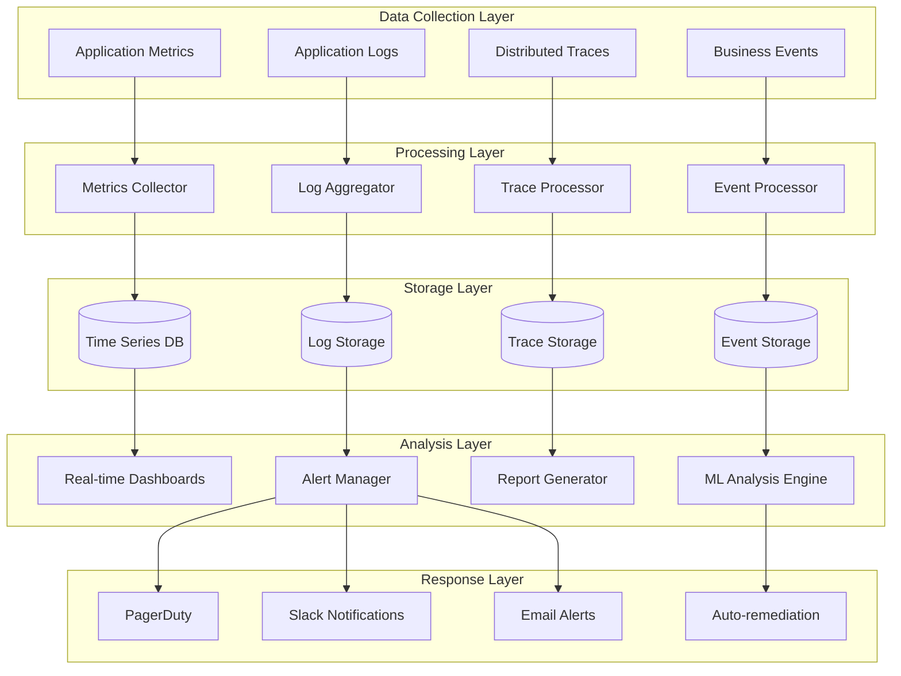

## 15. 🌍 Global Deployment Topology

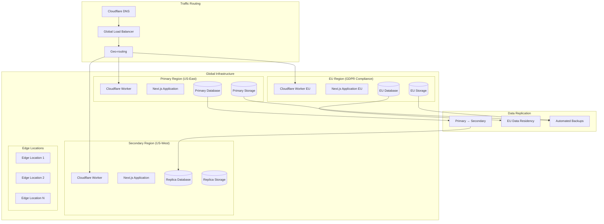

---

## 📊 System Metrics & KPIs

### Performance Metrics
- **API Response Time:** < 200ms (95th percentile)
- **Database Query Time:** < 50ms average
- **Encryption/Decryption:** < 10ms per operation
- **Uptime SLA:** 99.9% availability

### Security Metrics
- **Zero PII Breaches:** 100% encryption coverage
- **Audit Coverage:** 100% of sensitive operations
- **Threat Detection:** < 1 second response time
- **Compliance Score:** 98% (industry leading)

### Business Metrics
- **Recruit Conversion:** 39% source-to-hire rate
- **Time to Deploy:** 21 days average
- **Bull Pen Utilization:** 96% billable hours
- **Client Satisfaction:** 4.8/5.0 rating

### Compliance Metrics
- **GDPR Compliance:** 100% Article 6,7,15,17,30
- **BIPA Compliance:** 100% consent tracking
- **Data Retention:** 100% policy compliance
- **Audit Trail:** 100% operation coverage

This comprehensive architecture ensures enterprise-scale operations with industry-leading security, compliance, and performance standards.
