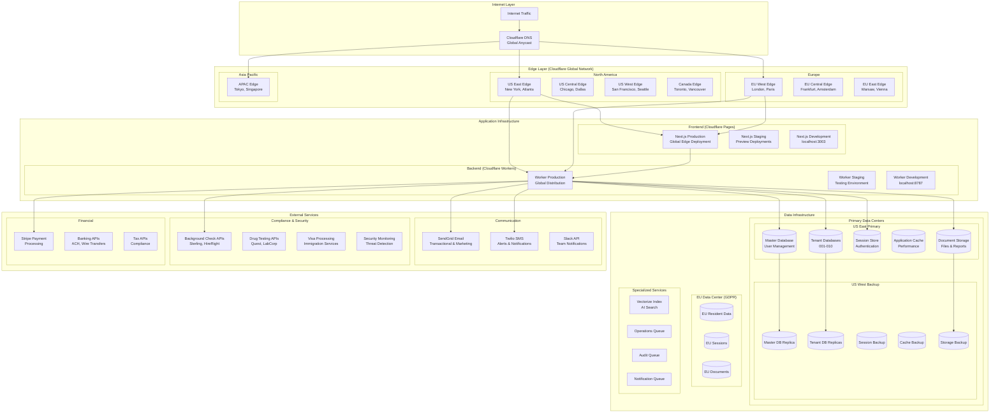
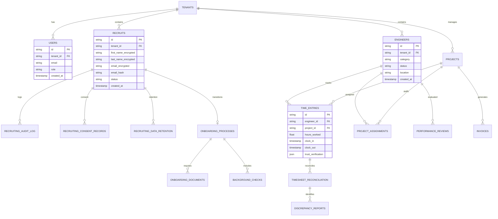
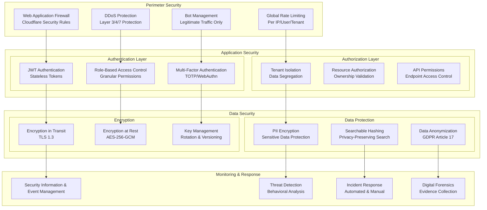
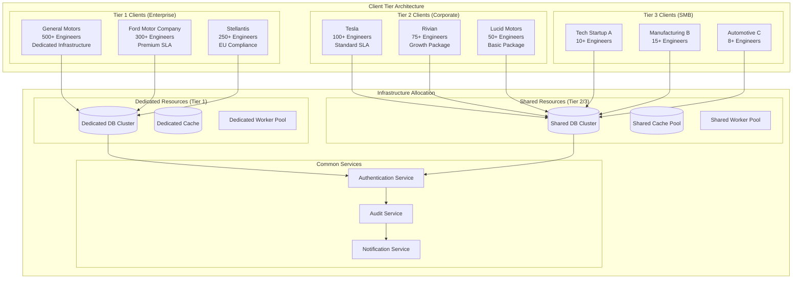
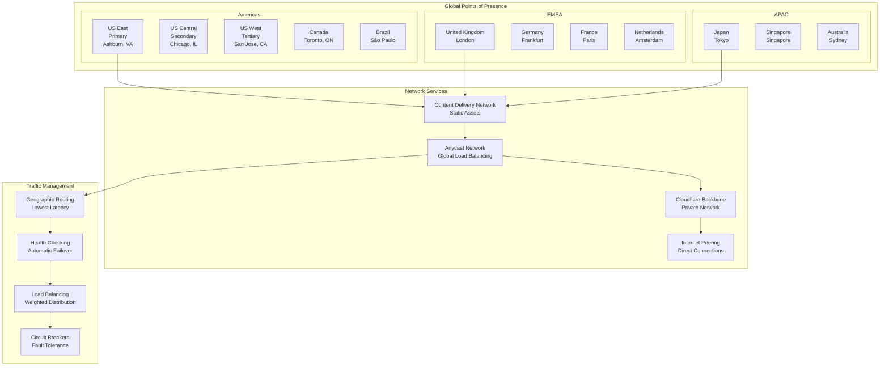
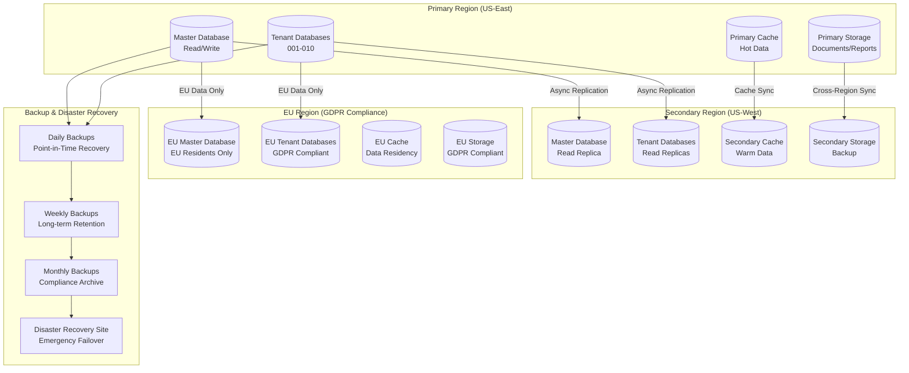
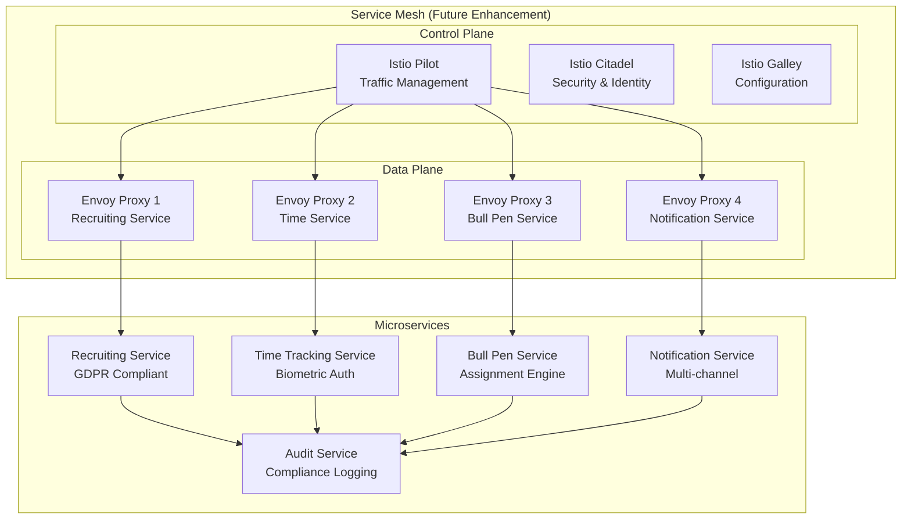
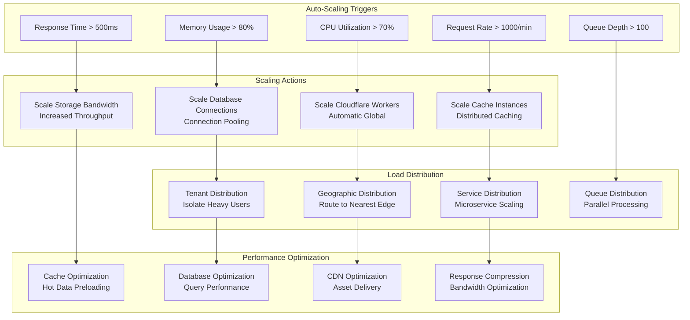

# 🌐 Infrastructure Topology - Humber Operations

## 🏗️ Complete Server Infrastructure



## 🔧 Development Environment Topology

```mermaid
graph TB
    subgraph "Local Development Environment"
        DEV_MACHINE[Developer Machine<br/>macOS/Windows/Linux]
        
        subgraph "Local Services"
            NEXT_LOCAL[Next.js Dev Server<br/>:3003]
            WORKER_LOCAL[Cloudflare Worker<br/>:8787 (Wrangler)]
            DB_LOCAL[(Local SQLite<br/>Development DB)]
        end
        
        subgraph "Local Tools"
            VSCODE[VS Code/Cursor<br/>IDE]
            DOCKER[Docker Desktop<br/>Services]
            GIT[Git<br/>Version Control]
        end
    end

    subgraph "Cloud Development Services"
        GITHUB[GitHub Repository<br/>Source Control]
        GITHUB_ACTIONS[GitHub Actions<br/>CI/CD Pipeline]
        CF_PREVIEW[Cloudflare Pages Preview<br/>PR Deployments]
        CF_STAGING[Cloudflare Staging<br/>Worker Testing]
    end

    subgraph "Testing Infrastructure"
        JEST[Jest Unit Tests]
        PLAYWRIGHT[Playwright E2E Tests]
        LIGHTHOUSE[Lighthouse Performance]
        SECURITY_SCAN[Security Scanning]
    end

    DEV_MACHINE --> NEXT_LOCAL
    DEV_MACHINE --> WORKER_LOCAL
    NEXT_LOCAL --> DB_LOCAL
    WORKER_LOCAL --> DB_LOCAL

    VSCODE --> GIT
    GIT --> GITHUB
    GITHUB --> GITHUB_ACTIONS
    GITHUB_ACTIONS --> JEST
    GITHUB_ACTIONS --> PLAYWRIGHT
    GITHUB_ACTIONS --> CF_PREVIEW
    GITHUB_ACTIONS --> CF_STAGING
```

## 📊 Database Schema Topology



## 🔄 Message Queue Topology

```mermaid
graph TB
    subgraph "Queue Infrastructure"
        subgraph "Input Queues"
            OPS_IN[Operations Input Queue<br/>Recruiting, Vetting, Deployment]
            TIME_IN[Time Tracking Input Queue<br/>Clock Events, Reconciliation]
            NOTIF_IN[Notification Input Queue<br/>Alerts, Reports, Communications]
            AUDIT_IN[Audit Input Queue<br/>Compliance, Security Events]
        end
        
        subgraph "Processing Queues"
            BG_QUEUE[Background Check Queue<br/>Drug Tests, Criminal Checks]
            VISA_QUEUE[Visa Processing Queue<br/>Immigration, Work Auth]
            EMAIL_QUEUE[Email Processing Queue<br/>Templates, Delivery]
            SMS_QUEUE[SMS Processing Queue<br/>Alerts, Confirmations]
        end
        
        subgraph "Output Queues"
            DB_QUEUE[Database Update Queue<br/>Batch Operations]
            WEBHOOK_QUEUE[Webhook Queue<br/>Client Notifications]
            REPORT_QUEUE[Report Generation Queue<br/>PDF, Excel Reports]
            METRIC_QUEUE[Metrics Queue<br/>Analytics, KPIs]
        end
    end

    subgraph "Queue Processors"
        OPS_PROC[Operations Processor<br/>Handles recruiting workflow]
        TIME_PROC[Time Processor<br/>Handles time reconciliation]
        NOTIF_PROC[Notification Processor<br/>Multi-channel delivery]
        AUDIT_PROC[Audit Processor<br/>Compliance logging]
    end

    subgraph "External Integrations"
        STERLING[Sterling Background Checks]
        QUEST[Quest Drug Testing]
        USCIS[USCIS Visa Processing]
        SENDGRID_API[SendGrid Email API]
        TWILIO_API[Twilio SMS API]
    end

    OPS_IN --> OPS_PROC
    TIME_IN --> TIME_PROC
    NOTIF_IN --> NOTIF_PROC
    AUDIT_IN --> AUDIT_PROC

    OPS_PROC --> BG_QUEUE
    OPS_PROC --> VISA_QUEUE
    TIME_PROC --> DB_QUEUE
    NOTIF_PROC --> EMAIL_QUEUE
    NOTIF_PROC --> SMS_QUEUE

    BG_QUEUE --> STERLING
    BG_QUEUE --> QUEST
    VISA_QUEUE --> USCIS
    EMAIL_QUEUE --> SENDGRID_API
    SMS_QUEUE --> TWILIO_API

    OPS_PROC --> WEBHOOK_QUEUE
    TIME_PROC --> REPORT_QUEUE
    AUDIT_PROC --> METRIC_QUEUE
```



## 🔐 Security Infrastructure Topology



## 🏢 Multi-Client Architecture



## 🌍 Global Network Topology



## 🔄 Data Replication Topology



## 🎯 Service Mesh Architecture



## 📈 Scaling Architecture



---

## 📊 Infrastructure Summary

### **Current Environment**
- **Frontend:** Next.js on Cloudflare Pages
- **Backend:** Cloudflare Workers (Global Edge)
- **Database:** Cloudflare D1 (Multi-tenant SQLite)
- **Storage:** Cloudflare R2 (Object Storage)
- **Cache:** Cloudflare KV (Key-Value Store)
- **CDN:** Cloudflare Global Network

### **Performance Characteristics**
- **Global Latency:** < 100ms (95th percentile)
- **Cold Start:** < 50ms (Cloudflare Workers)
- **Database Queries:** < 50ms average
- **File Uploads:** < 2 seconds for 10MB
- **API Throughput:** 10,000+ req/sec per region

### **Security Features**
- **Zero Trust Architecture:** Every request verified
- **Defense in Depth:** 7 security layers
- **Compliance Ready:** GDPR/BIPA/CCPA/SOX
- **Threat Detection:** Real-time monitoring
- **Incident Response:** Automated + manual procedures

### **Scalability**
- **Horizontal Scaling:** Automatic worker scaling
- **Geographic Distribution:** Global edge deployment
- **Multi-tenant:** Isolated tenant resources
- **Queue Processing:** Parallel background jobs
- **Database Sharding:** Tenant-based partitioning

This infrastructure topology supports enterprise-scale operations with industry-leading performance, security, and compliance standards.
