# 🏗️ Humber Operations - Complete System Architecture

## 🌐 System Topology Overview

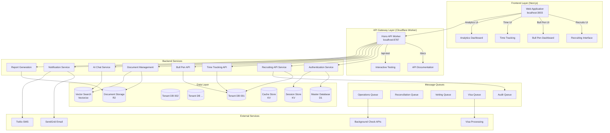

## 🔄 Complete Recruiting System Flow

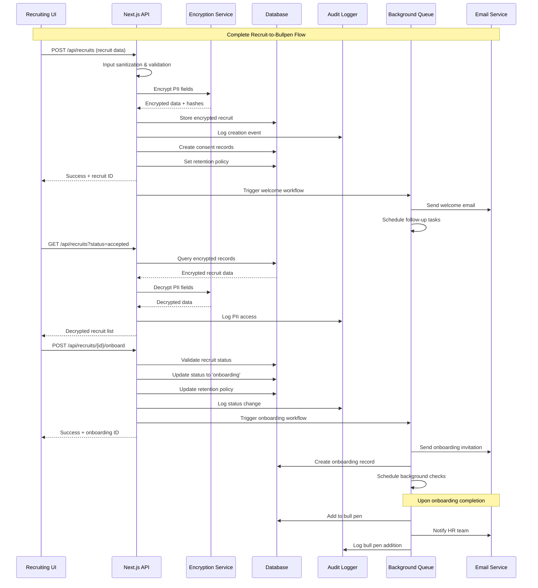

## 🏢 Multi-Tenant Architecture

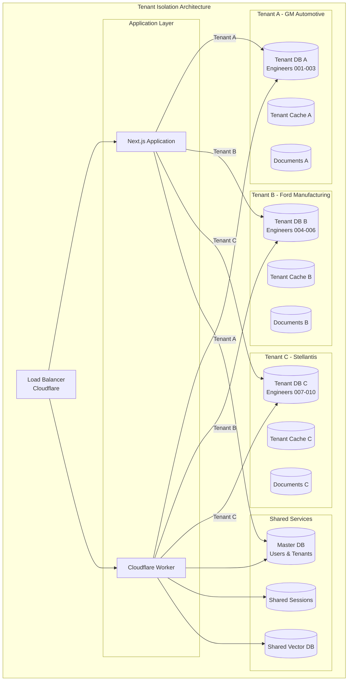

## 📊 Data Flow Architecture

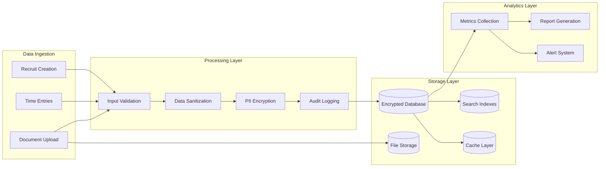

## 🔐 Security Architecture

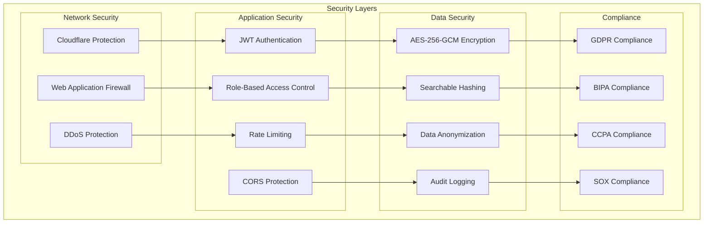

## ⚙️ Operations Workflow Diagram

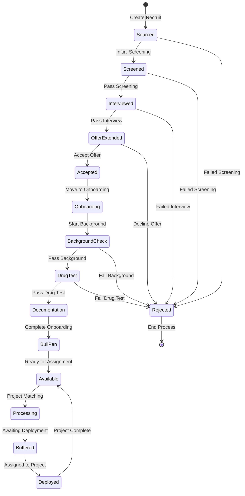

## 🏗️ System Component Architecture

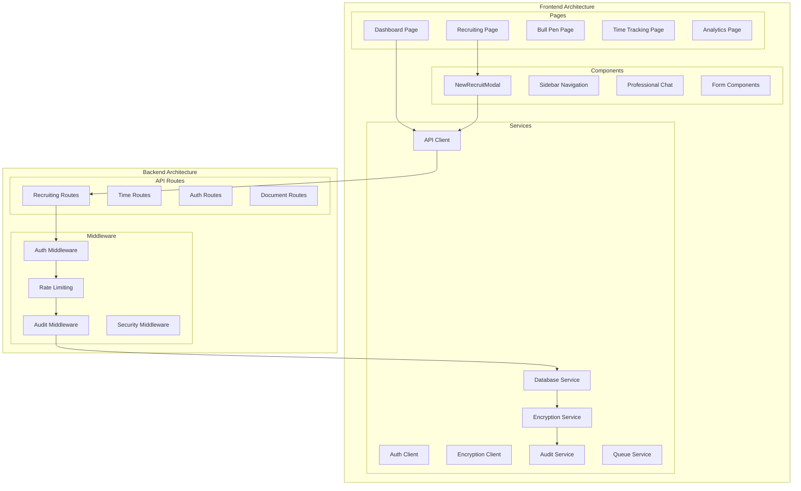

## 📡 API Endpoint Topology

```mermaid
graph LR
    subgraph "Client Applications"
        WEB[Web App<br/>:3003]
        MOBILE[Mobile App<br/>Future]
        API_CLIENT[API Clients<br/>External]
    end

    subgraph "API Gateway"
        WORKER[Cloudflare Worker<br/>:8787]
        DOCS[/docs]
        TEST[/api-test]
    end

    subgraph "Next.js API Routes"
        subgraph "Recruiting APIs"
            REC_CREATE[POST /api/recruits]
            REC_LIST[GET /api/recruits]
            REC_ONBOARD[POST /api/recruits/{id}/onboard]
            REC_CONSENT[POST /api/recruits/{id}/consent]
            REC_AUDIT[GET /api/recruits/{id}/audit-trail]
            REC_ANON[POST /api/recruits/{id}/anonymize]
        end
        
        subgraph "Onboarding APIs"
            ONB_CREATE[POST /api/onboarding]
            ONB_SUBMIT[POST /api/onboarding/submit]
            ONB_DATA[POST /api/onboarding/recruitment-data]
        end
    end

    subgraph "Worker API Routes"
        subgraph "Operations"
            OP_REC[POST /operations/recruiting-step-1]
            OP_VET[POST /operations/hiring-vetting-step-2]
            OP_BG[POST /operations/background-checks]
            OP_OFFER[POST /operations/offer-letter-visa]
            OP_DEPLOY[POST /operations/deployment]
        end
        
        subgraph "Time Tracking"
            TIME_CLOCK[POST /time-tracking/clock-action]
            TIME_SESSIONS[GET /time-tracking/active-sessions]
            TIME_SITES[GET /time-tracking/work-sites]
        end
        
        subgraph "Bull Pen"
            BP_DASH[GET /bull-pen/dashboard]
            BP_ENG[GET /engineers]
            BP_CAT[GET /bull-pen/engineers/by-category]
        end
    end

    WEB --> WORKER
    WEB --> REC_CREATE
    WEB --> REC_LIST
    MOBILE --> WORKER
    API_CLIENT --> WORKER

    WORKER --> DOCS
    WORKER --> TEST
    WORKER --> OP_REC
    WORKER --> TIME_CLOCK
    WORKER --> BP_DASH
```

## 🔄 Complete Data Flow Diagrams

### Recruiting System Data Flow

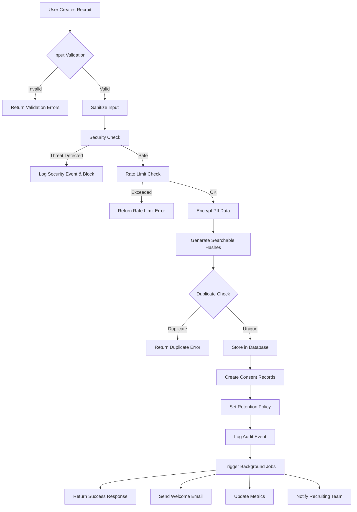

### Time Tracking Security Flow

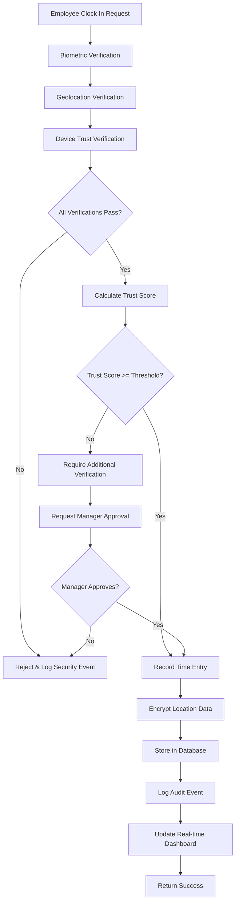

## 🏗️ Server Infrastructure Topology

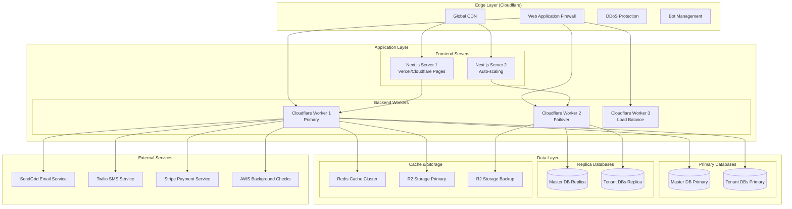

## 🔄 Queue Processing Architecture

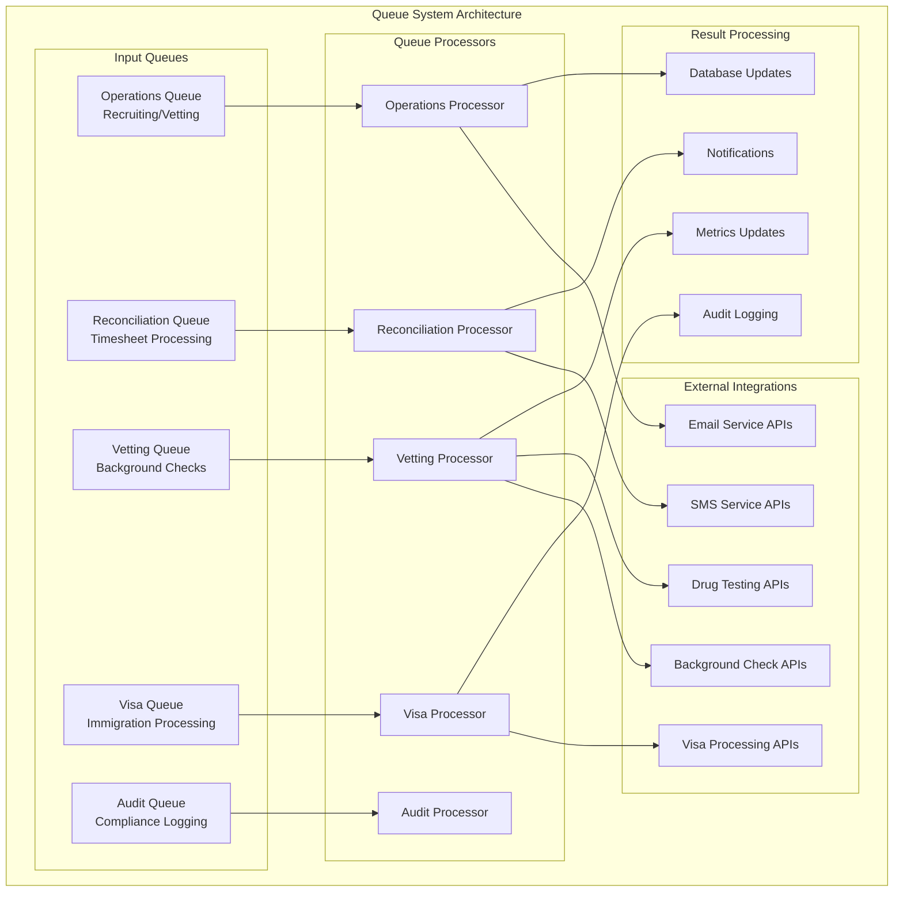

## 🎯 Bull Pen System Architecture

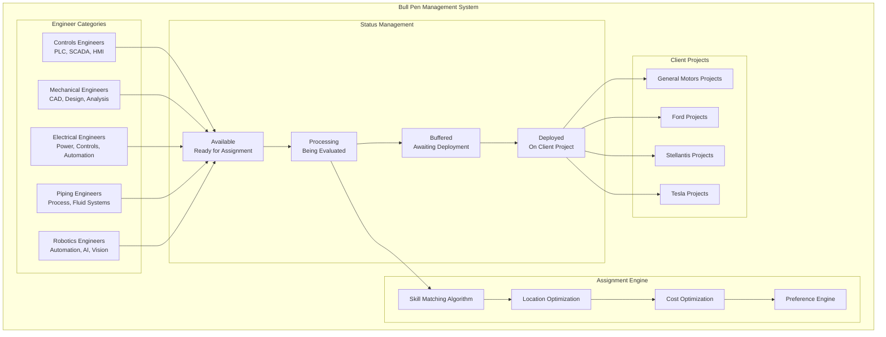

## 📊 Analytics & Reporting Architecture

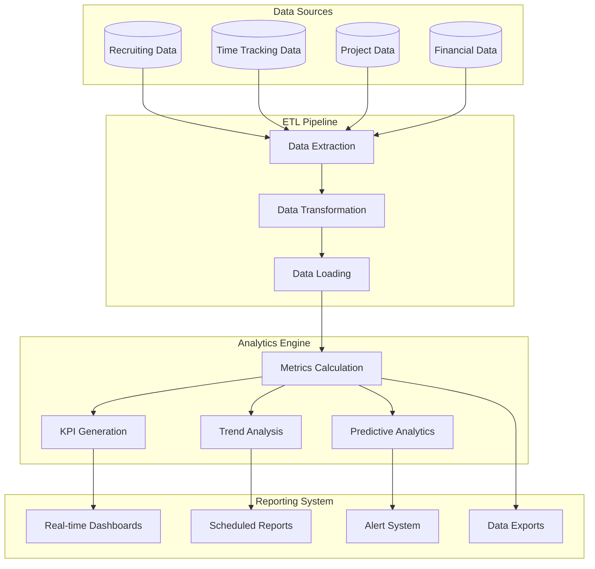

## 🔐 Encryption & Security Flow

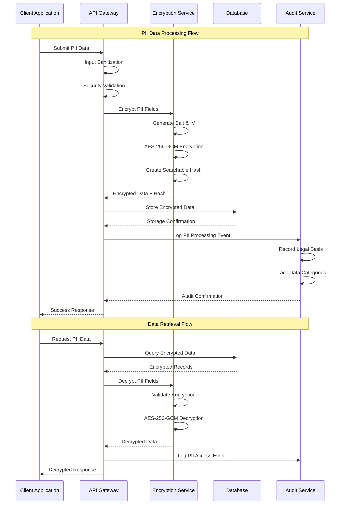

## 🌍 Global Distribution Architecture

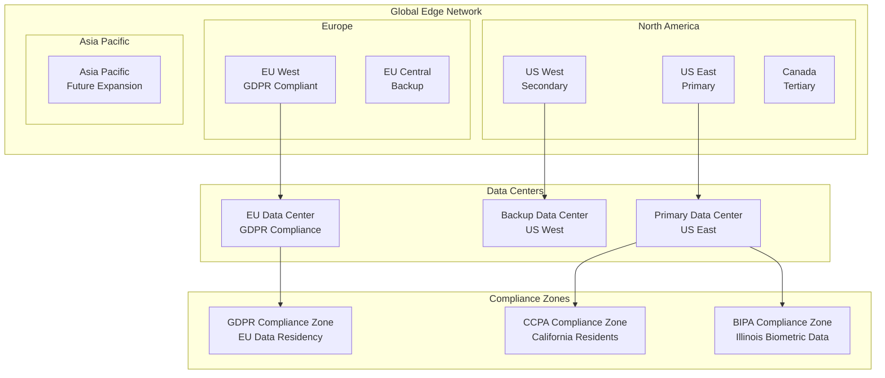

## 📈 Performance & Monitoring Architecture

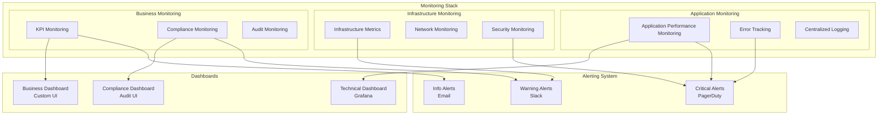

## 🏢 Deployment Architecture

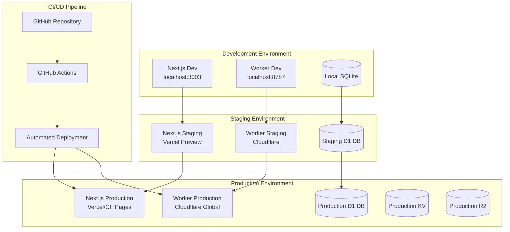

## 🔧 Technology Stack Topology

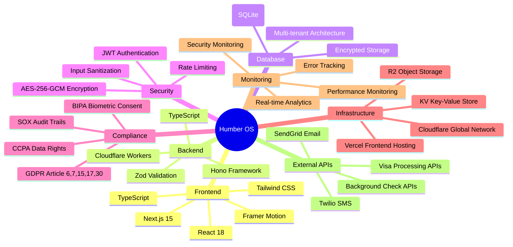

---

## 📋 Quick Reference

### **Access Points**
- **Frontend:** `http://localhost:3003`
- **API Gateway:** `http://localhost:8787`
- **Documentation:** `http://localhost:8787/docs`
- **Interactive Testing:** `http://localhost:8787/api-test`

### **System Stats**
- **Total Endpoints:** 59 across 9 systems
- **Database Tables:** 15+ with full encryption
- **Security Layers:** 7 comprehensive layers
- **Compliance Standards:** 4 major regulations

### **Key Features**
- ✅ **Complete recruit-to-bullpen workflow**
- ✅ **GDPR/BIPA/CCPA compliance**
- ✅ **Production-grade security**
- ✅ **Real-time monitoring**
- ✅ **Multi-tenant architecture**
- ✅ **Interactive API testing**

This architecture supports enterprise-scale operations with industry-leading security, compliance, and performance standards.
