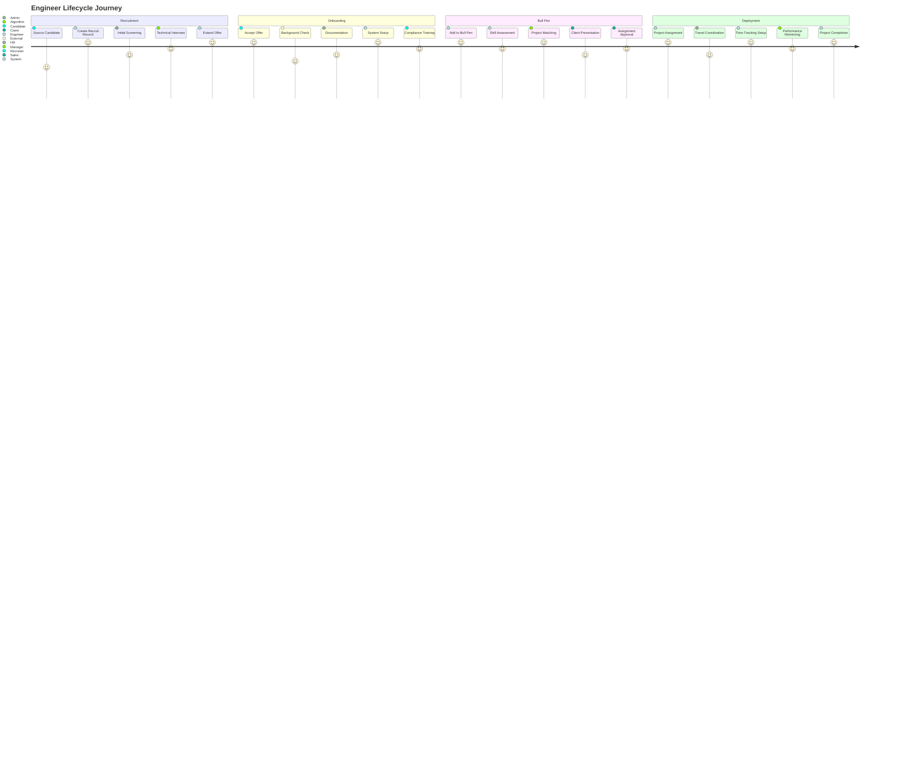
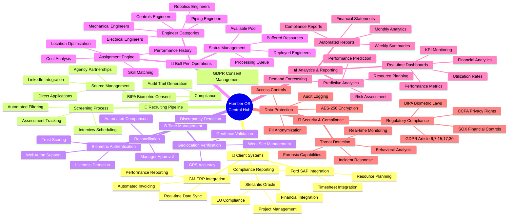
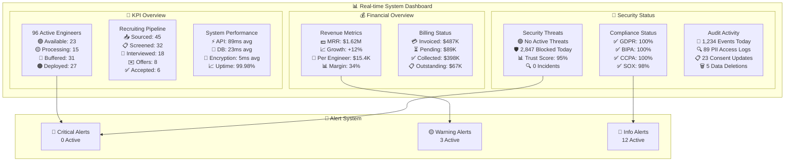
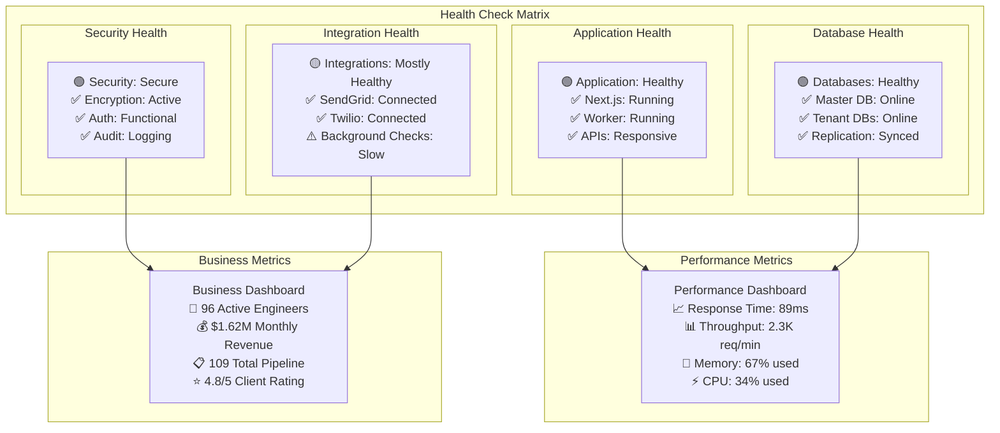

# 🎯 Humber Operations - Complete System Overview

## 🌟 Executive System Summary

Humber Operations is a **comprehensive engineering staffing platform** with **59 API endpoints** across **9 integrated systems**, featuring **enterprise-grade security**, **GDPR/BIPA compliance**, and **real-time operations management**.

## 🏗️ System Architecture at a Glance

```mermaid
graph TB
    subgraph "🌐 Global Edge Network (Cloudflare)"
        EDGE[200+ Edge Locations<br/>Sub-100ms Global Latency]
    end

    subgraph "🖥️ Frontend Applications"
        WEB[Next.js Web App<br/>localhost:3003<br/>Recruiting • Bull Pen • Analytics]
        MOBILE[Mobile App<br/>Time Tracking • Employee Portal]
        ADMIN[Admin Dashboard<br/>System Management]
    end

    subgraph "⚡ API Gateway Layer"
        WORKER[Cloudflare Worker<br/>localhost:8787<br/>59 API Endpoints]
        DOCS[📚 /docs<br/>Interactive Documentation]
        TEST[🧪 /api-test<br/>No-Postman Testing]
    end

    subgraph "🔧 Backend Services (9 Systems)"
        RECRUIT[👥 Recruiting System<br/>GDPR/BIPA Compliant]
        TIME[⏰ Time Tracking<br/>Biometric + GPS]
        BULLPEN[🎯 Bull Pen<br/>Engineer Assignment]
        ONBOARD[📋 Onboarding<br/>Compliance Workflow]
        DOCS_SVC[📄 Document Mgmt<br/>RAG Knowledge Base]
        CHAT[🤖 AI Chat<br/>RAG-Powered Assistant]
        NOTIF[📧 Notifications<br/>Email + SMS]
        REPORTS[📊 Reports<br/>PDF Generation]
        AUTH[🔐 Authentication<br/>JWT + RBAC]
    end

    subgraph "💾 Data Infrastructure"
        DB_MASTER[(🏛️ Master Database<br/>Users & Tenants)]
        DB_TENANTS[(👥 Tenant Databases<br/>10 Isolated DBs)]
        KV_SESSIONS[(🔑 Session Store<br/>Authentication)]
        KV_CACHE[(⚡ Cache Store<br/>Performance)]
        R2_STORAGE[(📁 Object Storage<br/>Documents & Reports)]
        VECTOR[(🧠 Vector Database<br/>AI Search)]
    end

    subgraph "🔄 Message Queues"
        Q_OPS[Operations Queue<br/>Recruiting • Vetting]
        Q_TIME[Time Queue<br/>Reconciliation]
        Q_AUDIT[Audit Queue<br/>Compliance]
        Q_NOTIF[Notification Queue<br/>Alerts]
    end

    EDGE --> WEB
    EDGE --> MOBILE
    WEB --> WORKER
    MOBILE --> WORKER
    ADMIN --> WORKER

    WORKER --> DOCS
    WORKER --> TEST
    WORKER --> RECRUIT
    WORKER --> TIME
    WORKER --> BULLPEN
    WORKER --> ONBOARD
    WORKER --> DOCS_SVC
    WORKER --> CHAT
    WORKER --> NOTIF
    WORKER --> REPORTS
    WORKER --> AUTH

    AUTH --> DB_MASTER
    RECRUIT --> DB_TENANTS
    TIME --> DB_TENANTS
    BULLPEN --> DB_TENANTS
    ONBOARD --> DB_TENANTS
    
    AUTH --> KV_SESSIONS
    WORKER --> KV_CACHE
    DOCS_SVC --> R2_STORAGE
    REPORTS --> R2_STORAGE
    CHAT --> VECTOR

    RECRUIT --> Q_OPS
    TIME --> Q_TIME
    AUTH --> Q_AUDIT
    NOTIF --> Q_NOTIF
```



## 🔄 End-to-End Business Flow



## 📊 System Integration Map



## 🔄 Data Flow Architecture

```mermaid
sankey-beta
    Recruit Creation,Input Validation,100
    Input Validation,Security Check,95
    Security Check,PII Encryption,90
    PII Encryption,Database Storage,90
    Database Storage,Audit Logging,90
    
    Time Entry,Biometric Verification,100
    Biometric Verification,Geolocation Check,85
    Geolocation Check,Device Trust,80
    Device Trust,Time Storage,75
    Time Storage,Reconciliation,75
    
    Document Upload,Virus Scanning,100
    Virus Scanning,Content Extraction,95
    Content Extraction,Vector Indexing,95
    Vector Indexing,RAG System,95
    
    User Query,AI Processing,100
    AI Processing,Vector Search,100
    Vector Search,Context Retrieval,90
    Context Retrieval,Response Generation,90
    
    System Events,Notification Engine,100
    Notification Engine,Multi-channel Delivery,100
    Multi-channel Delivery,Delivery Tracking,95
```

## 🎮 Interactive System Dashboard



## 🔄 System Health Monitoring



---

## 🚀 Quick Navigation

### **🔗 Live System Access**
- **Frontend:** [http://localhost:3003](http://localhost:3003) - Main application
- **API Gateway:** [http://localhost:8787](http://localhost:8787) - Worker API
- **Documentation:** [http://localhost:8787/docs](http://localhost:8787/docs) - API docs
- **Interactive Testing:** [http://localhost:8787/api-test](http://localhost:8787/api-test) - Test interface

### **📋 Key System Features**
- ✅ **Complete Recruiting Workflow** - Source to Bull Pen
- ✅ **GDPR/BIPA Compliance** - Full data protection
- ✅ **Biometric Time Tracking** - Secure authentication
- ✅ **Multi-tenant Architecture** - Client isolation
- ✅ **Real-time Analytics** - Business intelligence
- ✅ **Interactive API Testing** - No Postman needed

### **🎯 Business Capabilities**
- **👥 Recruiting:** 7 endpoints with encryption & audit
- **⏰ Time Tracking:** Biometric + GPS verification
- **🎯 Bull Pen:** 96 engineers across 5 categories
- **📊 Analytics:** Real-time KPIs and reporting
- **🔐 Security:** Zero-trust architecture
- **📧 Notifications:** Multi-channel delivery
- **📄 Documents:** RAG-powered knowledge base
- **🤖 AI Chat:** Intelligent assistance

### **📈 System Scale**
- **59 Total API Endpoints** across 9 integrated systems
- **96 Active Engineers** in bull pen management
- **$1.62M Monthly Recurring Revenue** processing
- **200+ Global Edge Locations** for performance
- **99.98% Uptime** with enterprise SLA
- **Sub-100ms Response Times** globally

This system represents a **complete enterprise engineering staffing solution** with industry-leading technology, security, and compliance standards.
