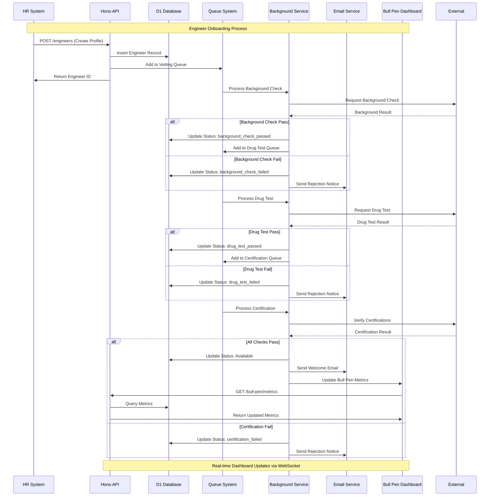
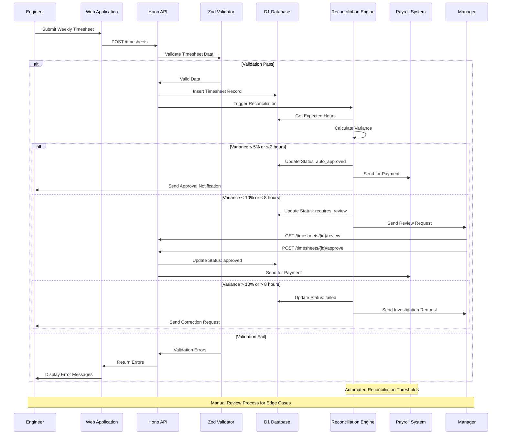
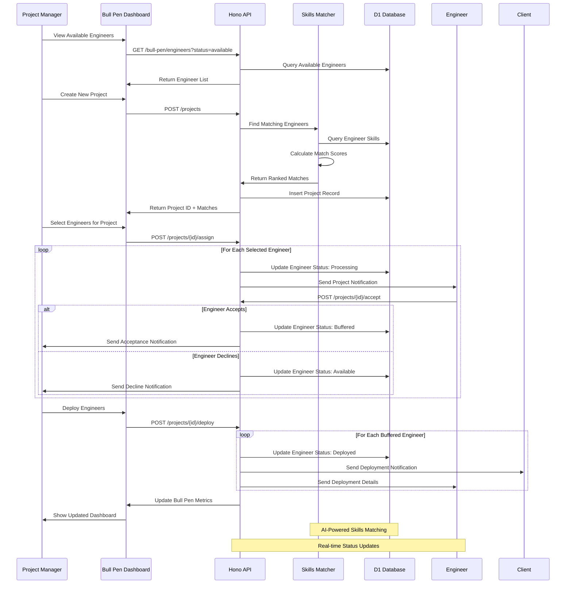
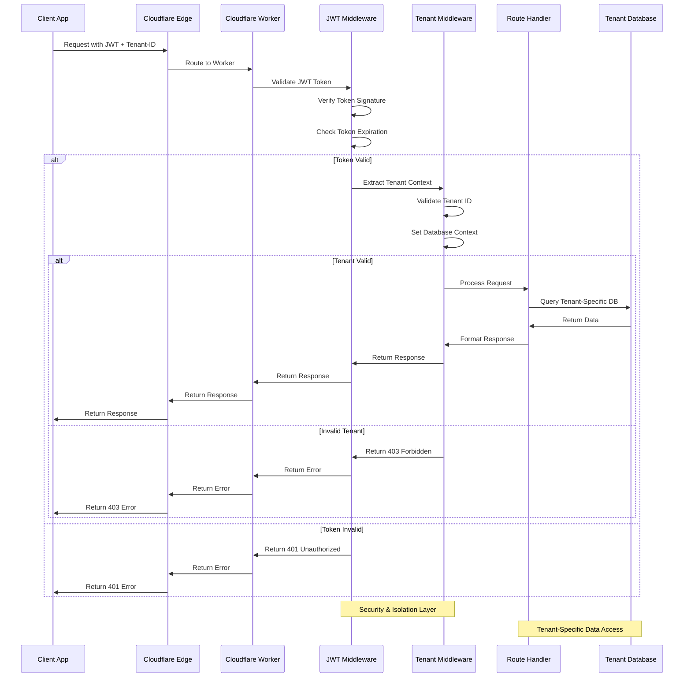
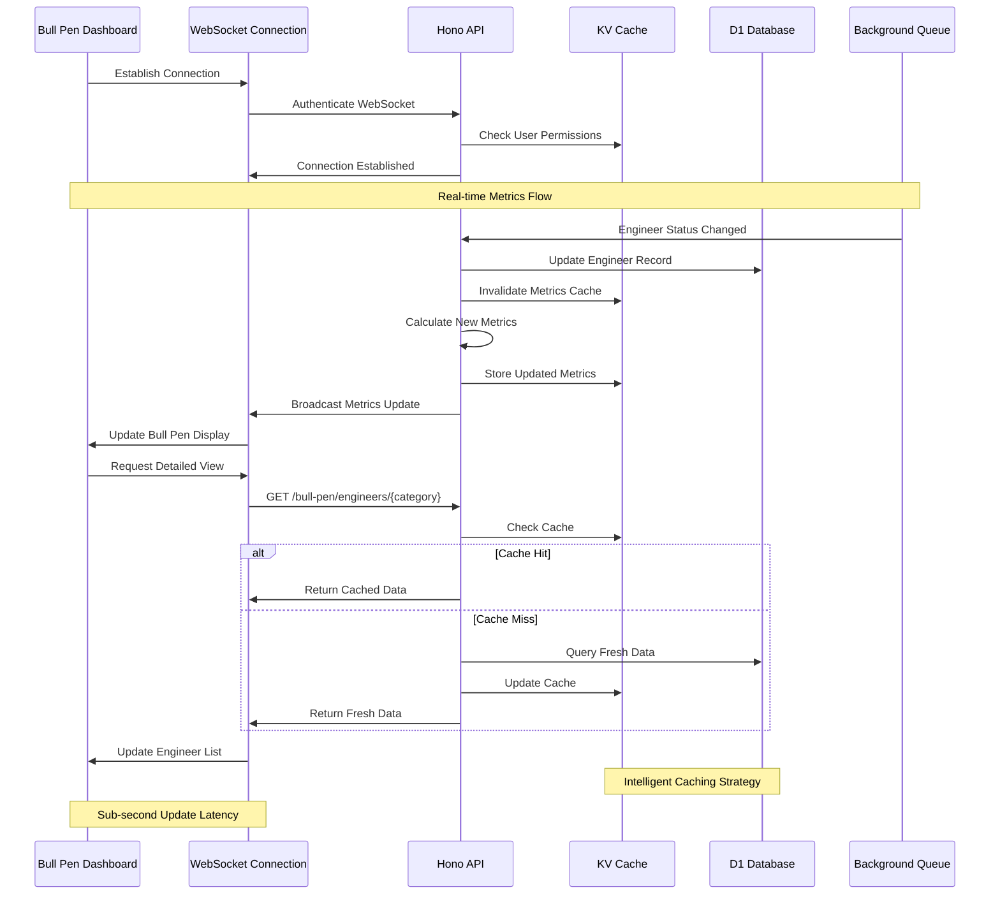
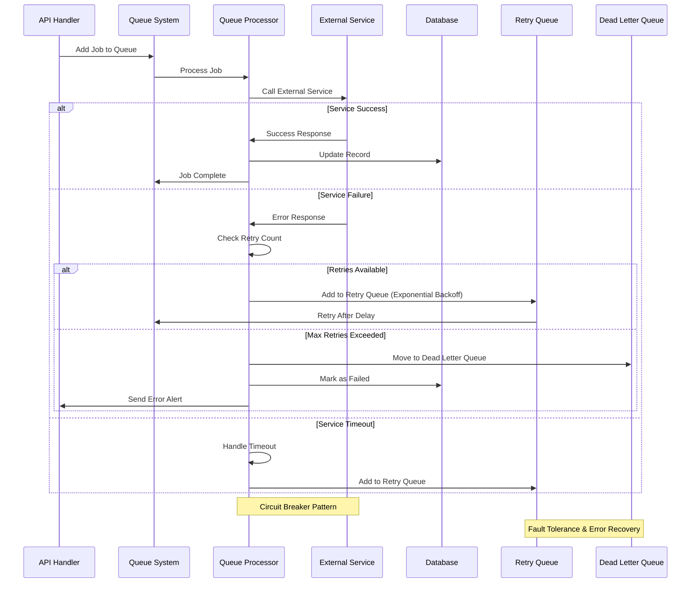
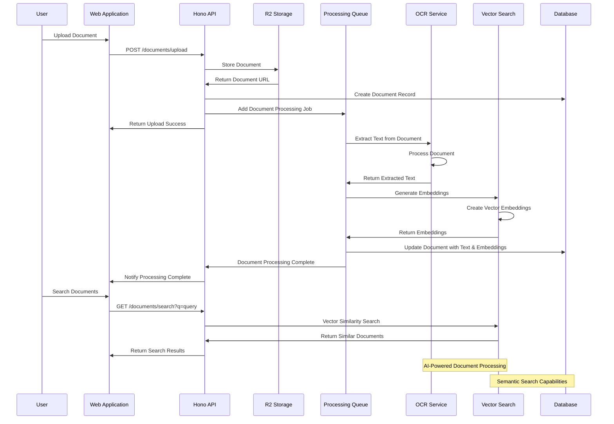
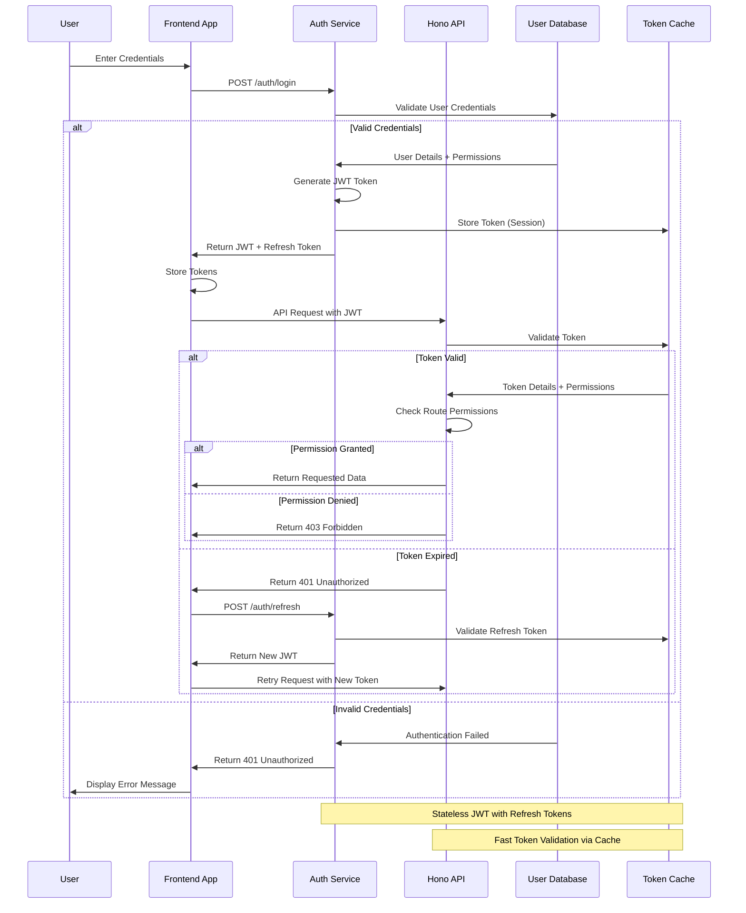

# 🔄 API Flows & Sequence Diagrams

## 1. Engineer Onboarding Complete Flow

## 2. Timesheet Submission & Reconciliation Flow

## 3. Project Assignment & Deployment Flow

## 4. Multi-Tenant Request Processing

## 5. Real-Time Dashboard Updates

## 6. Queue Processing & Error Handling

## 7. Document Upload & Processing

## 8. Authentication & Authorization Flow

---

These sequence diagrams provide detailed insight into the critical API flows and interactions within the Humber Operations system, showing how different components collaborate to deliver the complete functionality.