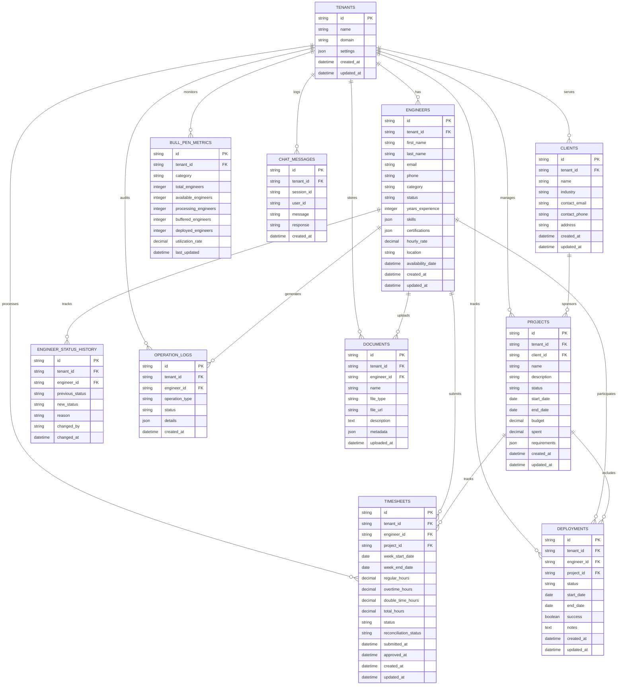
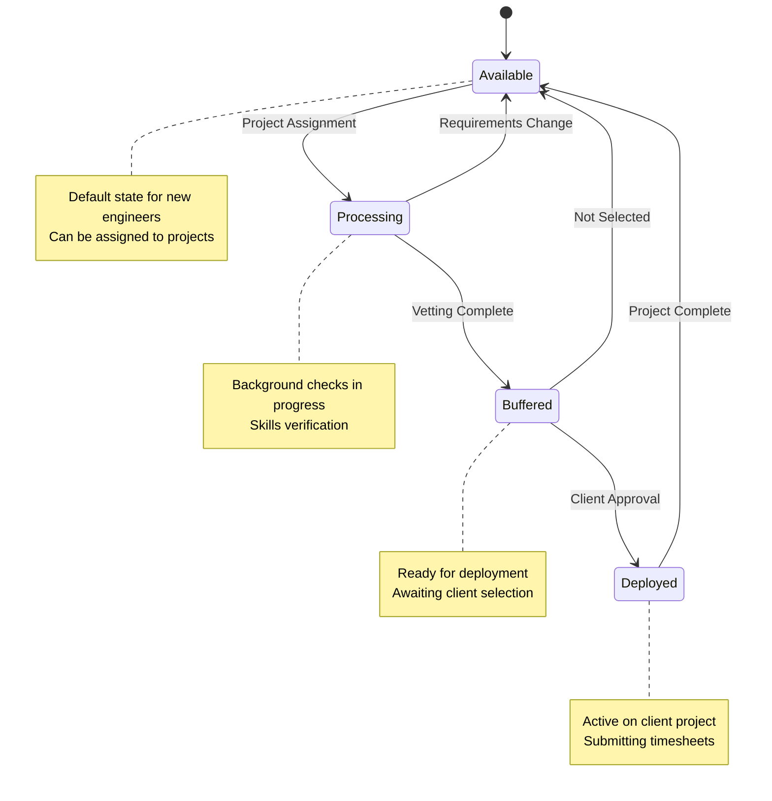
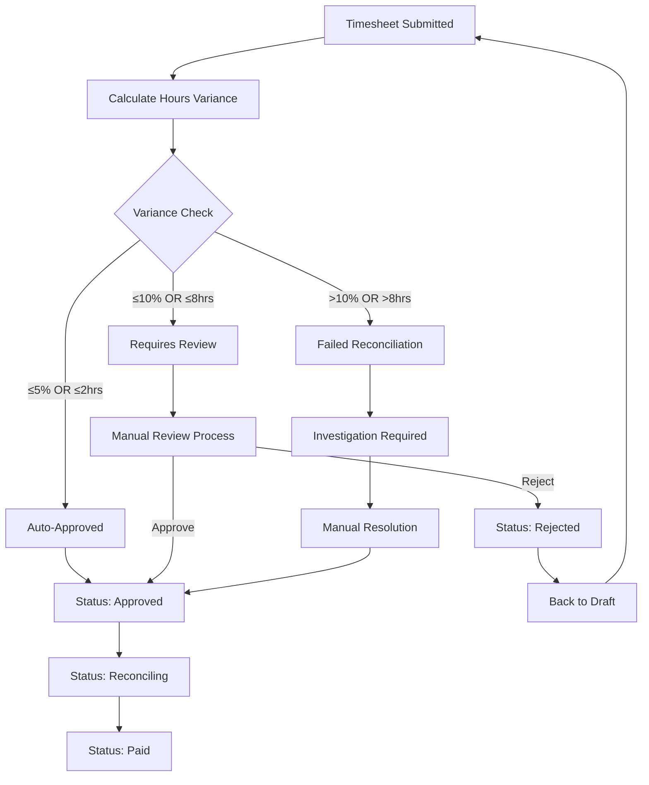
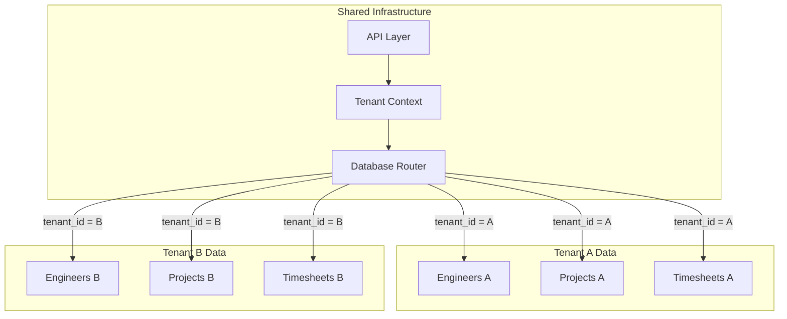

# 🗄️ Database Schema & Entity Relationships

## Entity Relationship Diagram



## Table Schemas

### Engineers Table
```sql
CREATE TABLE engineers (
    id TEXT PRIMARY KEY,
    tenant_id TEXT NOT NULL REFERENCES tenants(id),
    first_name TEXT NOT NULL,
    last_name TEXT NOT NULL,
    email TEXT NOT NULL UNIQUE,
    phone TEXT,
    category TEXT NOT NULL CHECK (category IN ('Controls', 'Mechanical', 'Electrical', 'Piping', 'Robotics')),
    status TEXT NOT NULL DEFAULT 'Available' CHECK (status IN ('Available', 'Processing', 'Buffered', 'Deployed')),
    years_experience INTEGER NOT NULL CHECK (years_experience >= 0),
    skills JSON NOT NULL DEFAULT '[]',
    certifications JSON NOT NULL DEFAULT '[]',
    hourly_rate DECIMAL(10,2) NOT NULL CHECK (hourly_rate > 0),
    location TEXT NOT NULL,
    availability_date DATE,
    created_at DATETIME NOT NULL DEFAULT CURRENT_TIMESTAMP,
    updated_at DATETIME NOT NULL DEFAULT CURRENT_TIMESTAMP
);

-- Indexes for performance
CREATE INDEX idx_engineers_tenant_status ON engineers(tenant_id, status);
CREATE INDEX idx_engineers_category ON engineers(category);
CREATE INDEX idx_engineers_availability ON engineers(availability_date);
```

### Timesheets Table
```sql
CREATE TABLE timesheets (
    id TEXT PRIMARY KEY,
    tenant_id TEXT NOT NULL REFERENCES tenants(id),
    engineer_id TEXT NOT NULL REFERENCES engineers(id),
    project_id TEXT NOT NULL REFERENCES projects(id),
    week_start_date DATE NOT NULL,
    week_end_date DATE NOT NULL,
    regular_hours DECIMAL(5,2) NOT NULL DEFAULT 0 CHECK (regular_hours >= 0 AND regular_hours <= 40),
    overtime_hours DECIMAL(5,2) NOT NULL DEFAULT 0 CHECK (overtime_hours >= 0 AND overtime_hours <= 20),
    double_time_hours DECIMAL(5,2) NOT NULL DEFAULT 0 CHECK (double_time_hours >= 0 AND double_time_hours <= 10),
    total_hours DECIMAL(5,2) GENERATED ALWAYS AS (regular_hours + overtime_hours + double_time_hours) STORED,
    status TEXT NOT NULL DEFAULT 'draft' CHECK (status IN ('draft', 'submitted', 'approved', 'reconciling', 'paid')),
    reconciliation_status TEXT CHECK (reconciliation_status IN ('auto_approved', 'requires_review', 'failed', 'resolved')),
    submitted_at DATETIME,
    approved_at DATETIME,
    created_at DATETIME NOT NULL DEFAULT CURRENT_TIMESTAMP,
    updated_at DATETIME NOT NULL DEFAULT CURRENT_TIMESTAMP,
    
    -- Business rules
    CONSTRAINT total_hours_limit CHECK (total_hours <= 70),
    CONSTRAINT valid_week_dates CHECK (week_end_date > week_start_date),
    CONSTRAINT valid_submission_flow CHECK (
        (status = 'draft' AND submitted_at IS NULL) OR
        (status != 'draft' AND submitted_at IS NOT NULL)
    )
);

-- Indexes for timesheet queries
CREATE INDEX idx_timesheets_engineer_week ON timesheets(engineer_id, week_start_date);
CREATE INDEX idx_timesheets_status ON timesheets(status);
CREATE INDEX idx_timesheets_reconciliation ON timesheets(reconciliation_status);
```

### Projects Table
```sql
CREATE TABLE projects (
    id TEXT PRIMARY KEY,
    tenant_id TEXT NOT NULL REFERENCES tenants(id),
    client_id TEXT NOT NULL REFERENCES clients(id),
    name TEXT NOT NULL,
    description TEXT,
    status TEXT NOT NULL DEFAULT 'planning' CHECK (status IN ('planning', 'active', 'on_hold', 'completed', 'cancelled')),
    start_date DATE NOT NULL,
    end_date DATE,
    budget DECIMAL(12,2) NOT NULL CHECK (budget > 0),
    spent DECIMAL(12,2) NOT NULL DEFAULT 0 CHECK (spent >= 0),
    requirements JSON NOT NULL DEFAULT '[]',
    created_at DATETIME NOT NULL DEFAULT CURRENT_TIMESTAMP,
    updated_at DATETIME NOT NULL DEFAULT CURRENT_TIMESTAMP,
    
    -- Business rules
    CONSTRAINT valid_project_dates CHECK (end_date IS NULL OR end_date >= start_date),
    CONSTRAINT budget_constraint CHECK (spent <= budget * 1.1) -- Allow 10% overage
);

-- Indexes for project management
CREATE INDEX idx_projects_tenant_status ON projects(tenant_id, status);
CREATE INDEX idx_projects_client ON projects(client_id);
CREATE INDEX idx_projects_dates ON projects(start_date, end_date);
```

## Data Relationships & Business Rules

### Engineer Status Flow


### Timesheet Reconciliation Logic


### Multi-Tenant Data Isolation


## Performance Optimization

### Critical Indexes
```sql
-- Engineer queries
CREATE INDEX idx_engineers_tenant_status ON engineers(tenant_id, status);
CREATE INDEX idx_engineers_category_available ON engineers(category, status) WHERE status = 'Available';
CREATE INDEX idx_engineers_skills ON engineers USING GIN(skills) WHERE status = 'Available';

-- Timesheet queries
CREATE INDEX idx_timesheets_engineer_week ON timesheets(engineer_id, week_start_date DESC);
CREATE INDEX idx_timesheets_reconciliation_pending ON timesheets(reconciliation_status) WHERE reconciliation_status IN ('requires_review', 'failed');
CREATE INDEX idx_timesheets_payroll ON timesheets(status, approved_at) WHERE status = 'approved';

-- Project queries
CREATE INDEX idx_projects_active ON projects(tenant_id, status) WHERE status = 'active';
CREATE INDEX idx_projects_budget_tracking ON projects(client_id, status, budget, spent);

-- Bull pen metrics
CREATE INDEX idx_bull_pen_tenant_category ON bull_pen_metrics(tenant_id, category);
CREATE INDEX idx_bull_pen_last_updated ON bull_pen_metrics(last_updated DESC);

-- Operation logs for auditing
CREATE INDEX idx_operation_logs_tenant_date ON operation_logs(tenant_id, created_at DESC);
CREATE INDEX idx_operation_logs_engineer ON operation_logs(engineer_id, created_at DESC);
```

### Query Patterns
```sql
-- Get available engineers by category
SELECT e.id, e.first_name, e.last_name, e.category, e.skills
FROM engineers e
WHERE e.tenant_id = ? 
  AND e.status = 'Available'
  AND e.category = ?
ORDER BY e.years_experience DESC, e.availability_date ASC;

-- Calculate bull pen metrics
SELECT 
    category,
    COUNT(*) as total_engineers,
    SUM(CASE WHEN status = 'Available' THEN 1 ELSE 0 END) as available,
    SUM(CASE WHEN status = 'Processing' THEN 1 ELSE 0 END) as processing,
    SUM(CASE WHEN status = 'Buffered' THEN 1 ELSE 0 END) as buffered,
    SUM(CASE WHEN status = 'Deployed' THEN 1 ELSE 0 END) as deployed,
    ROUND(
        SUM(CASE WHEN status = 'Deployed' THEN 1 ELSE 0 END) * 100.0 / COUNT(*), 2
    ) as utilization_rate
FROM engineers 
WHERE tenant_id = ?
GROUP BY category;

-- Timesheet reconciliation query
SELECT 
    t.id,
    t.engineer_id,
    t.total_hours as submitted_hours,
    p.expected_hours,
    ABS(t.total_hours - p.expected_hours) as variance_hours,
    ROUND(ABS(t.total_hours - p.expected_hours) / p.expected_hours * 100, 2) as variance_percent
FROM timesheets t
JOIN project_assignments p ON t.project_id = p.project_id AND t.engineer_id = p.engineer_id
WHERE t.status = 'submitted' AND t.tenant_id = ?
ORDER BY variance_percent DESC;
```

## Data Migration Strategy

### Version Control
```sql
-- Migration tracking table
CREATE TABLE schema_migrations (
    version TEXT PRIMARY KEY,
    applied_at DATETIME NOT NULL DEFAULT CURRENT_TIMESTAMP,
    description TEXT NOT NULL
);

-- Example migration
INSERT INTO schema_migrations (version, description) 
VALUES ('20240115_001', 'Initial schema creation');
```

### Backup Strategy
```sql
-- Automated backup views for critical data
CREATE VIEW engineer_backup AS
SELECT 
    id, tenant_id, first_name, last_name, email, category, status,
    created_at, updated_at
FROM engineers
WHERE updated_at >= datetime('now', '-7 days');

CREATE VIEW timesheet_backup AS
SELECT 
    id, tenant_id, engineer_id, project_id, week_start_date,
    total_hours, status, reconciliation_status, created_at
FROM timesheets
WHERE created_at >= datetime('now', '-30 days');
```

---

This database schema provides a solid foundation for the Humber Operations system with proper relationships, constraints, and performance optimizations.