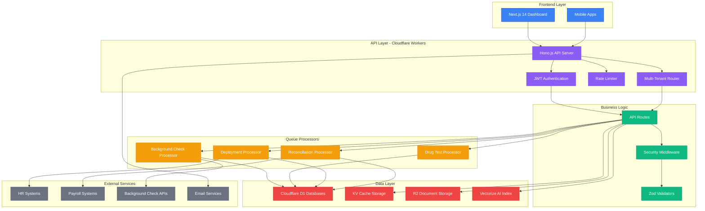
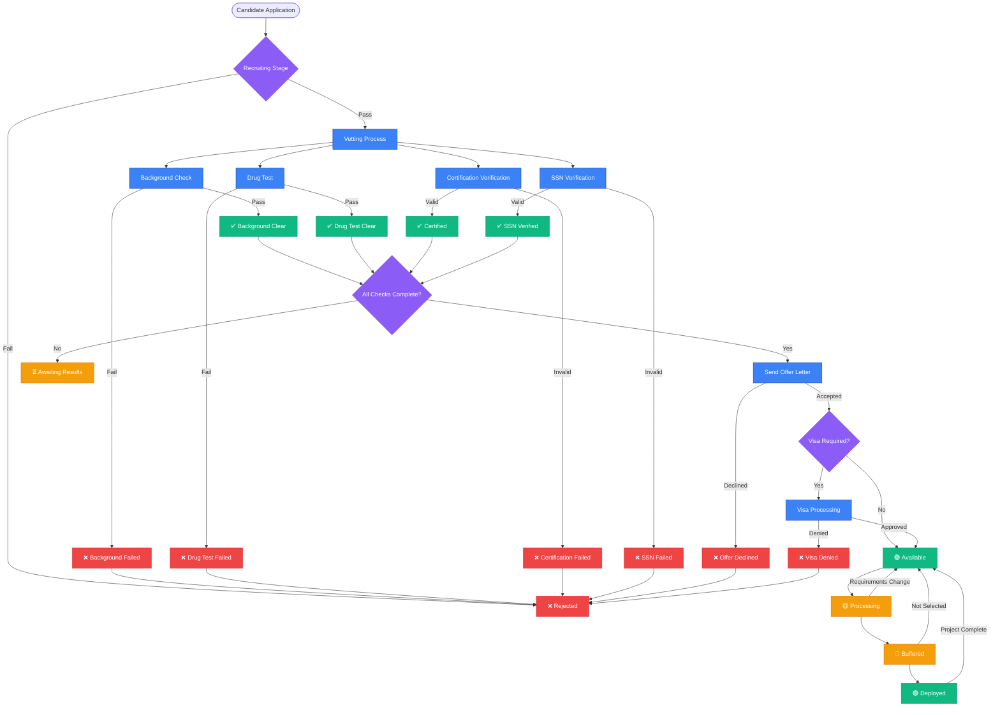
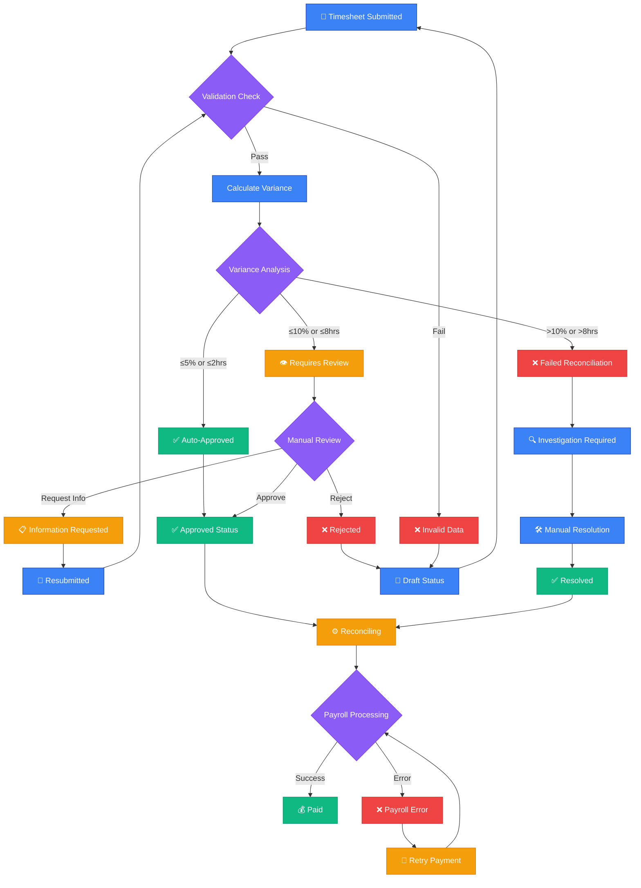
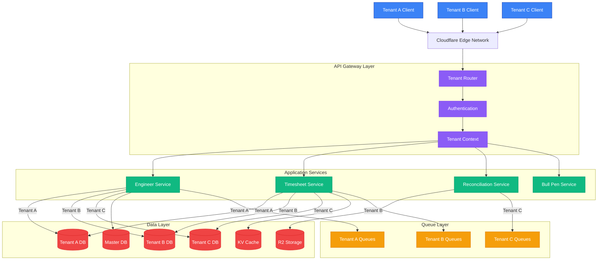
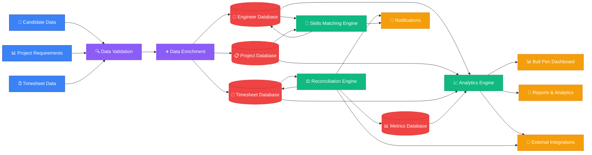
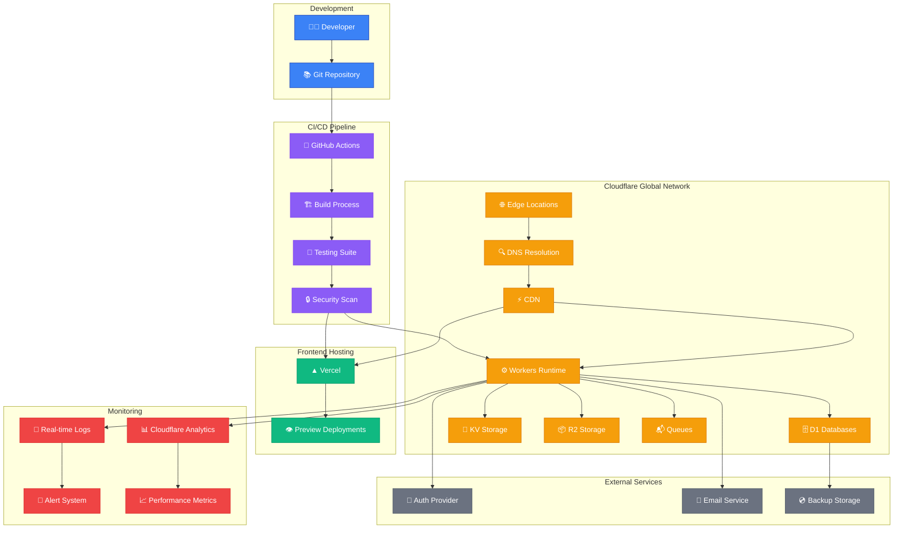
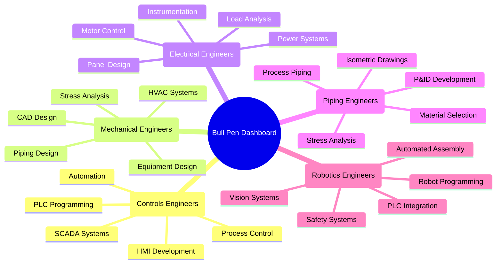
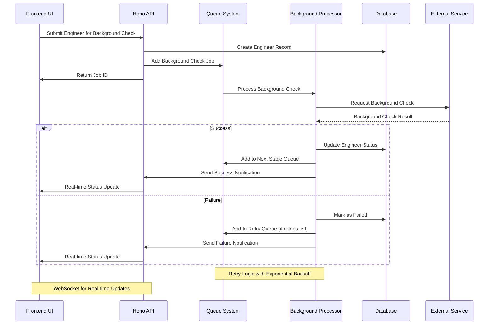
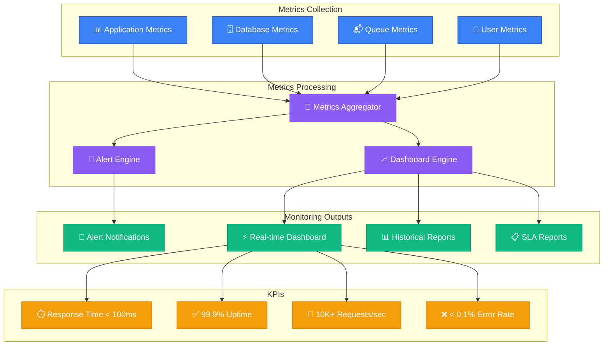

# 🏗️ Humber Operations - System Architecture & Diagrams

## 1. System Architecture Overview

## 2. Engineer Lifecycle Flow

## 3. Timesheet Reconciliation Flow

## 4. Multi-Tenant Architecture

## 5. Data Flow Diagram

## 6. Deployment Architecture

## 7. Engineer Categories & Bull Pen Organization

## 8. Queue Processing Architecture

## 9. Security Architecture

```mermaid
graph LR
    %% Entry Points
    USER[👤 User Request]
    API_CALL[🔌 API Call]
    
    %% Security Layers
    subgraph "Security Layers"
        WAF[🛡️ Web Application Firewall]
        DDOS[🚫 DDoS Protection]
        RATE_LIMIT[⏱️ Rate Limiting]
        JWT_AUTH[🔐 JWT Authentication]
        RBAC[👥 Role-Based Access Control]
        TENANT_ISOLATION[🏢 Tenant Isolation]
        INPUT_VALIDATION[✅ Input Validation]
        SQL_INJECTION[🛡️ SQL Injection Protection]
    end
    
    %% Data Protection
    subgraph "Data Protection"
        ENCRYPTION[🔒 Encryption at Rest]
        TLS[🔐 TLS in Transit]
        PII_MASKING[🎭 PII Masking]
        AUDIT_LOG[📝 Audit Logging]
    end
    
    %% Compliance
    subgraph "Compliance"
        GDPR[🇪🇺 GDPR Compliance]
        SOC2[📊 SOC 2 Type II]
        RETENTION[🗃️ Data Retention]
        RIGHT_DELETE[🗑️ Right to Delete]
    end

    %% Flow
    USER --> WAF
    API_CALL --> WAF
    WAF --> DDOS
    DDOS --> RATE_LIMIT
    RATE_LIMIT --> JWT_AUTH
    JWT_AUTH --> RBAC
    RBAC --> TENANT_ISOLATION
    TENANT_ISOLATION --> INPUT_VALIDATION
    INPUT_VALIDATION --> SQL_INJECTION
    
    SQL_INJECTION --> ENCRYPTION
    ENCRYPTION --> TLS
    TLS --> PII_MASKING
    PII_MASKING --> AUDIT_LOG
    
    AUDIT_LOG --> GDPR
    GDPR --> SOC2
    SOC2 --> RETENTION
    RETENTION --> RIGHT_DELETE

    %% Styling
    classDef entry fill:#3b82f6,stroke:#1e40af,color:#fff
    classDef security fill:#ef4444,stroke:#dc2626,color:#fff
    classDef data fill:#8b5cf6,stroke:#7c3aed,color:#fff
    classDef compliance fill:#10b981,stroke:#059669,color:#fff

    class USER,API_CALL entry
    class WAF,DDOS,RATE_LIMIT,JWT_AUTH,RBAC,TENANT_ISOLATION,INPUT_VALIDATION,SQL_INJECTION security
    class ENCRYPTION,TLS,PII_MASKING,AUDIT_LOG data
    class GDPR,SOC2,RETENTION,RIGHT_DELETE compliance
```

## 10. Performance Monitoring Dashboard

---

These diagrams provide a comprehensive visual representation of the Humber Operations system architecture, workflows, and key processes. Each diagram focuses on different aspects of the system to help understand the complete ecosystem.